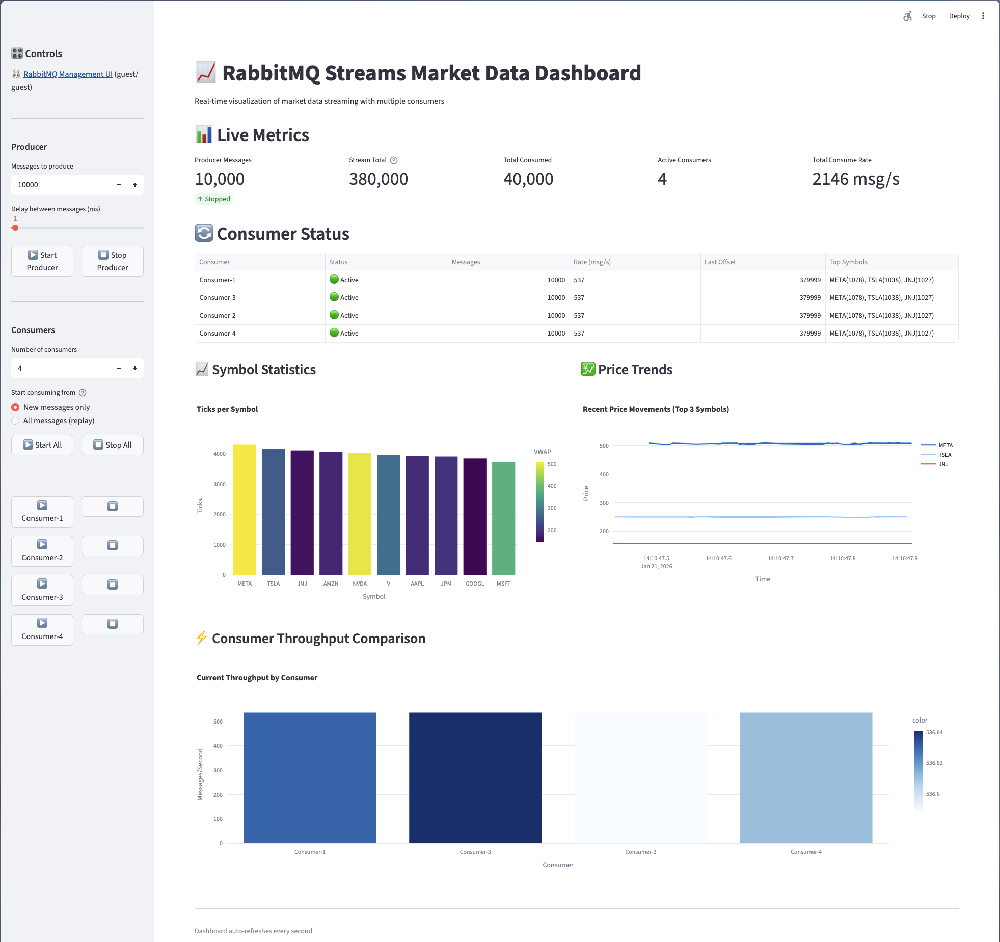

# RabbitMQ Streams for Algorithmic Trading

Building scalable, resilient trading infrastructure with RabbitMQ Streams for market data distribution and order routing.

---

**Category:** Engineering  
**Difficulty:** Advanced  
**Read Time:** 35 min  
**Published:** February 5, 2025  
**Last Modified:** February 5, 2025  
**Status:** Draft  
**Tags:** Infrastructure, Trading Systems, Messaging, Python, RabbitMQ

---

## Introduction

Most trading systems fail not because of bad algorithms, but because of infrastructure brittleness. A single market data feed lag, a dropped order, or a network glitch can wipe out profits.

RabbitMQ Streams is a distributed message broker designed for exactly these problems: guaranteed delivery, persistent storage, replay capability, and horizontal scaling. Unlike traditional request-response systems, Streams enable:

- **Multiple consumers** of the same market data without coupling
- **Replay from history** - rewind and reprocess all trades for debugging
- **Backpressure handling** - gracefully handle data spikes without dropping messages
- **Fault tolerance** - automatic failover and recovery

This guide shows how to build production-grade trading infrastructure on RabbitMQ Streams.

### What You'll Learn

- RabbitMQ Streams fundamentals and why they're ideal for trading infrastructure
- Setting up market data streams with the Python `rstream` client
- Consumer patterns: basic, batching, single-active, and replay consumers
- Event sourcing architecture for complete audit trails
- Backpressure handling and flow control strategies
- Consumer groups for horizontal scaling
- Real-time aggregation across multiple exchanges
- Production best practices and monitoring with Streamlit dashboard

### Prerequisites

- Python 3.10+ programming experience
- Familiarity with async/await patterns and asyncio
- Understanding of messaging concepts (producers, consumers, queues)
- Docker and Docker Compose basics
- Trading concepts (market data, ticks, VWAP, bid/ask)

---

## Why RabbitMQ Streams for Market Data?

| Feature | Benefit for Market Data |
|---------|------------------------|
| **Persistent Log** | Replay historical data for backtesting strategies |
| **High Throughput** | Handle millions of ticks per second |
| **Time-based Consumption** | Start consuming from any point in time |
| **Offset Tracking** | Resume from last position after failures |
| **Single Active Consumer** | Maintain ordering with automatic failover |
| **Non-destructive Reads** | Multiple consumers read the same data |

---

## Part 1: RabbitMQ Streams Fundamentals

RabbitMQ Streams are append-only logs (like Kafka), but with RabbitMQ's simplicity. Every message is persisted, and consumers can replay from any point in time.

### Project Structure

```
rabbitmq-streams-trading/
├── docker-compose.yml              # RabbitMQ with Streams enabled
├── pyproject.toml                  # Project config & dependencies (uv)
├── src/
│   ├── __init__.py
│   ├── config.py                   # Stream configuration
│   ├── models.py                   # MarketData model with Pydantic
│   ├── producer.py                 # Simulated market data publisher
│   ├── consumer.py                 # Basic consumer with offset options
│   ├── single_active_consumer.py   # Ordered processing with failover
│   ├── batching_consumer.py        # High-throughput micro-batching
│   ├── replay_consumer.py          # Historical data replay
│   └── dashboard.py                # Streamlit visualization dashboard
└── README.md
```

### Quick Start

**1. Start RabbitMQ with Streams**

```bash
cd rabbitmq-streams-trading
docker compose up -d
```

Wait for RabbitMQ to be healthy and access the management UI at http://localhost:15672 (guest/guest)

**2. Install Dependencies with uv**

```bash
uv sync
```

**3. Run the Producer**

```bash
uv run python -m src.producer
```

**4. Run the Streamlit Dashboard**

```bash
uv run streamlit run src/dashboard.py
```

### Market Data Publisher

```python
import pika
from pika.adapters.blocking_connection import BlockingConnection
import json
from datetime import datetime

class MarketDataPublisher:
    """Publish tick data to RabbitMQ Streams"""
    
    def __init__(self, rabbitmq_host: str = "localhost", 
                 stream_name: str = "market_data"):
        self.stream_name = stream_name
        
        # Connect with stream plugin
        credentials = pika.PlainCredentials("guest", "guest")
        parameters = pika.ConnectionParameters(
            host=rabbitmq_host,
            credentials=credentials
        )
        
        self.connection = pika.BlockingConnection(parameters)
        self.channel = self.connection.channel()
        
        # Declare stream (idempotent - safe to call multiple times)
        self.channel.queue_declare(
            queue=stream_name,
            durable=True,
            arguments={
                'x-queue-type': 'stream',
                # Retention: keep messages for 7 days
                'x-max-age': '7d',
                # Max size: 10GB per stream
                'x-stream-max-length-bytes': 10737418240
            }
        )
    
    def publish_tick(self, tick_data: dict):
        """Publish a single tick to the stream"""
        
        message = json.dumps({
            'timestamp': datetime.utcnow().isoformat(),
            'ticker': tick_data['ticker'],
            'price': tick_data['price'],
            'volume': tick_data['volume'],
            'bid': tick_data.get('bid'),
            'ask': tick_data.get('ask'),
        })
        
        # Publish with confirmation
        self.channel.basic_publish(
            exchange='',
            routing_key=self.stream_name,
            body=message.encode(),
            properties=pika.BasicProperties(
                delivery_mode=2,  # Persistent delivery
                content_type='application/json'
            )
        )
```

**Key concept:** Unlike queues where messages disappear after consumption, Streams persist all messages. Consumers independently track their position in the stream—new consumers can start from the beginning or the tail.

---

## Part 2: Stream Consumers with Offset Management

A single market data stream can feed multiple trading strategies. Each strategy independently consumes messages from wherever it wants in the stream.

### Basic Consumer with Offset Options

```python
from src.consumer import MarketDataConsumer
from src.config import StreamConfig

config = StreamConfig.defaults()
consumer = MarketDataConsumer(config)

await consumer.start()

# Start from the beginning (replay all)
await consumer.consume_from_first(handler)

# Start from the last message
await consumer.consume_from_last(handler)

# Only new messages
await consumer.consume_from_next(handler)

# Resume from a specific offset
await consumer.consume_from_offset(12345, handler)

# Start from a specific time
from datetime import datetime
await consumer.consume_from_timestamp(
    datetime(2024, 1, 15, 9, 30), 
    handler
)

# Filter by symbols
await consumer.consume_symbols(
    offset_spec, 
    handler, 
    {"AAPL", "GOOGL"}
)
```

### Multiple Consumers

RabbitMQ Streams supports multiple concurrent consumers reading from the same stream:

```python
# Each consumer reads independently - non-destructive reads
consumer1 = MarketDataConsumer(config)
consumer2 = MarketDataConsumer(config)
consumer3 = MarketDataConsumer(config)

# All three can consume from the same stream simultaneously
# Each tracks its own offset independently
await consumer1.consume_from_first(handler1)  # Reads all from beginning
await consumer2.consume_from_last(handler2)   # Reads only latest
await consumer3.consume_from_offset(5000, handler3)  # Reads from offset 5000
```

**Key benefits:**
- **Non-destructive reads**: Unlike queues, messages aren't removed after consumption
- **Independent offsets**: Each consumer tracks its own position
- **Parallel processing**: Multiple consumers can process concurrently
- **Replay capability**: New consumers can read historical data

---

## Part 3: Single Active Consumer Pattern

Ensures ordered processing with automatic failover:

```python
from src.single_active_consumer import SingleActiveConsumer

consumer = SingleActiveConsumer(config, "processor-1")

async def handle_message(data: MarketData, offset: int):
    # Only the active consumer processes messages
    await process_market_data(data)

await consumer.start(handle_message)

# Check if this instance is active
if consumer.is_active:
    print("I am the active consumer")
```

Run multiple instances for high availability:

```bash
# Terminal 1
uv run python -m src.single_active_consumer consumer-1

# Terminal 2 (standby, will activate if consumer-1 fails)
uv run python -m src.single_active_consumer consumer-2
```

---

## Part 4: High-Throughput Batching Consumer

For high-throughput scenarios with aggregation:

```python
from src.batching_consumer import BatchingConsumer

consumer = BatchingConsumer(
    config,
    batch_size=1000,
    batch_timeout_ms=100,
)

async def handle_batch(batch: list[MarketData]):
    # Process batch of market data
    stats = BatchingConsumer.aggregate_by_symbol(batch)
    
    # Calculate VWAP per symbol
    for symbol, stat in stats.items():
        print(f"{symbol}: VWAP={stat.vwap}, High={stat.high}, Low={stat.low}")

await consumer.start(handle_batch)
```

**Batching benefits:**
- Reduced processing overhead
- Aggregate statistics (VWAP, high/low, volume)
- Better throughput for downstream systems

---

## Part 5: Historical Data Replay

For backtesting and historical analysis:

```python
from src.replay_consumer import ReplayConsumer
from datetime import datetime

consumer = ReplayConsumer(config)
await consumer.start()

# Replay all data
result = await consumer.replay_all(timeout_seconds=60)

# Replay specific time range
result = await consumer.replay_time_range(
    from_time=datetime(2024, 1, 15, 9, 30),
    to_time=datetime(2024, 1, 15, 10, 0),
    timeout_seconds=60,
)

# Replay specific symbols
result = await consumer.replay_symbols(
    {"AAPL", "GOOGL", "MSFT"},
    timeout_seconds=60,
)

# Access results
aapl_data = result.get_data_for_symbol("AAPL")
result.print_summary()
```

**Replay use cases:**
- Strategy backtesting
- Bug investigation and debugging
- Compliance audits
- Training ML models on historical data

---

## Part 6: Event Sourcing - Complete Audit Trail

Every trade, order, and decision should be logged immutably. RabbitMQ Streams enables complete event sourcing: rebuild any historical state by replaying events.

```python
from enum import Enum
from dataclasses import dataclass, asdict

class EventType(Enum):
    MARKET_DATA = "market_data"
    ORDER_CREATED = "order_created"
    ORDER_FILLED = "order_filled"
    ORDER_CANCELLED = "order_cancelled"
    TRADE_EXECUTED = "trade_executed"
    POSITION_UPDATED = "position_updated"
    ERROR = "error"

@dataclass
class TradingEvent:
    """Immutable event in the audit log"""
    event_type: EventType
    timestamp: str
    data: dict
    
    def to_json(self) -> str:
        return json.dumps(asdict(self))

class AuditLogPublisher:
    """Publish all trading events to audit stream"""
    
    def __init__(self, rabbitmq_host: str = "localhost"):
        self.stream_name = "trading_audit_log"
        
        # Create audit stream with longer retention
        self.channel.queue_declare(
            queue=self.stream_name,
            durable=True,
            arguments={
                'x-queue-type': 'stream',
                # Keep audit logs for 1 year
                'x-max-age': '365d'
            }
        )
    
    def log_order_created(self, order_id: str, ticker: str, 
                         quantity: int, price: float, side: str):
        """Log order creation"""
        event = TradingEvent(
            event_type=EventType.ORDER_CREATED,
            timestamp=datetime.utcnow().isoformat(),
            data={
                'order_id': order_id,
                'ticker': ticker,
                'quantity': quantity,
                'price': price,
                'side': side
            }
        )
        self._publish_event(event)
```

**Power of event sourcing:** At 3:47 PM, you discover a bug. Replay the audit log from 9:30 AM. See every trade that was executed based on the buggy logic. Calculate exact P&L impact. Perfect for compliance and debugging.

---

## Part 7: Handling Backpressure & Flow Control

Market data can spike (earnings announcements, flash crashes). Naive systems drop messages. RabbitMQ Streams handle this with prefetch limits and consumer groups.

```python
class BackpressureAwareConsumer:
    """Process stream messages with proper flow control"""
    
    def __init__(self, rabbitmq_host: str = "localhost",
                 stream_name: str = "market_data",
                 prefetch_count: int = 100):
        self.stream_name = stream_name
        self.prefetch_count = prefetch_count
        
        # Set prefetch: process max 100 messages before requiring ACK
        # Higher prefetch = better throughput, but more memory
        # Lower prefetch = lower latency
        self.channel.basic_qos(prefetch_count=prefetch_count)
    
    def process_with_timeout_and_retry(self, callback, 
                                       max_retries: int = 3):
        """Handle slow processing with retry logic"""
        
        def wrapped_callback(ch, method, properties, body):
            tick = json.loads(body.decode())
            
            retry_count = 0
            while retry_count < max_retries:
                try:
                    callback(tick)
                    ch.basic_ack(delivery_tag=method.delivery_tag)
                    break
                except Exception as e:
                    retry_count += 1
                    
                    if retry_count >= max_retries:
                        # Give up, send to dead letter queue
                        self._send_to_dlq(tick, str(e))
                        ch.basic_nack(delivery_tag=method.delivery_tag, 
                                     requeue=False)
                    else:
                        # Exponential backoff
                        time.sleep(0.5 * retry_count)
```

**Flow control:** When strategy processing slows down, RabbitMQ automatically throttles incoming messages. No data loss, no crashes.

---

## Part 8: Consumer Groups - Scaling Strategies

Run multiple instances of the same strategy. Consumer groups automatically distribute messages so each is processed exactly once.

```python
class ConsumerGroup:
    """Distribute work across multiple consumer instances"""
    
    def create_consumer_in_group(self, consumer_id: str,
                                callback: Callable):
        """Join consumer group to process stream partitions"""
        
        # RabbitMQ Streams automatically partition data across consumers
        # Each message processed by exactly one consumer in the group
        
        self.channel.basic_qos(prefetch_count=100)
        
        # Consumer tag identifies this instance in the group
        self.channel.basic_consume(
            queue=self.stream_name,
            on_message_callback=wrapped_callback,
            consumer_tag=f"{self.group_name}_{consumer_id}",
            arguments={'x-stream-offset': 'last'}
        )

# Deploy multiple strategy instances
def deploy_strategy_instances(num_instances: int = 3):
    """Deploy multiple instances of trading strategy"""
    
    threads = []
    for i in range(num_instances):
        t = threading.Thread(target=strategy_worker, args=(i,))
        t.daemon = True
        t.start()
        threads.append(t)
```

**Scaling:** Start with 1 strategy instance. As volume grows, launch 2, 3, 10 instances. RabbitMQ automatically distributes work. Each message processed exactly once.

---

## Part 9: Real-Time Aggregation Across Exchanges

Combine market data from multiple exchanges into a single stream for cross-exchange strategies.

```python
class MultiExchangeAggregator:
    """Aggregate ticks from multiple exchanges into unified stream"""
    
    def __init__(self, rabbitmq_host: str = "localhost"):
        self.unified_stream = "unified_market_data"
    
    def aggregate_exchanges(self, exchange_names: list):
        """Subscribe to all exchanges and republish to unified stream"""
        
        for exchange in exchange_names:
            exchange_stream = f"market_data_{exchange.lower()}"
            
            # Each exchange in its own thread
            consumer_thread = threading.Thread(
                target=self._consume_and_aggregate,
                args=(exchange, exchange_stream)
            )
            consumer_thread.daemon = True
            consumer_thread.start()
    
    def _consume_and_aggregate(self, exchange: str, stream_name: str):
        """Consume from exchange stream and republish"""
        
        def callback(ch, method, properties, body):
            tick = json.loads(body.decode())
            
            # Add exchange metadata
            enriched_tick = {
                **tick,
                'exchange': exchange,
                'received_at': datetime.utcnow().isoformat()
            }
            
            # Republish to unified stream
            self.channel.basic_publish(
                exchange='',
                routing_key=self.unified_stream,
                body=json.dumps(enriched_tick).encode(),
            )
```

**Cross-exchange strategies:** Subscribe to unified stream. Process ticks from NYSE, NASDAQ, CBOE in order. Execute arbitrage or statistical strategies across venues.

---

## Part 10: Real-Time Dashboard with Streamlit

The project includes a comprehensive Streamlit dashboard for monitoring:



### Dashboard Features

- **Live Metrics**: Producer messages, stream total, total consumed, active consumers, consume rate
- **Consumer Status**: Real-time status, message counts, rates, last offsets, top symbols per consumer
- **Symbol Statistics**: Ticks per symbol bar chart with VWAP calculations
- **Price Trends**: Real-time price movement charts for top symbols
- **Consumer Throughput Comparison**: Side-by-side throughput visualization

### Running the Dashboard

```bash
uv run streamlit run src/dashboard.py
```

The dashboard auto-refreshes every second, providing real-time visibility into your streaming infrastructure.

---

## Market Data Model

```python
from src.models import MarketData
from decimal import Decimal
from datetime import datetime, timezone

tick = MarketData(
    symbol="AAPL",
    bid_price=Decimal("185.50"),
    ask_price=Decimal("185.52"),
    bid_size=Decimal("500"),
    ask_size=Decimal("300"),
    last_price=Decimal("185.51"),
    last_size=Decimal("100"),
    volume=Decimal("5000000"),
    timestamp=datetime.now(timezone.utc),
    exchange="NASDAQ",
    sequence_number=12345,
)

# Computed properties
print(tick.spread)     # 0.02
print(tick.mid_price)  # 185.51

# Serialization
bytes_data = tick.to_bytes()
restored = MarketData.from_bytes(bytes_data)
```

---

## Configuration

### Stream Settings

```python
from src.config import StreamConfig

config = StreamConfig(
    host="localhost",
    port=5552,
    username="guest",
    password="guest",
    stream_name="market-data",
    max_age_seconds=86400,           # Retain data for 24 hours
    max_length_bytes=10_000_000_000, # Max 10 GB
    max_segment_size_bytes=500_000_000,  # 500 MB per segment
)
```

---

## Best Practices for Production

1. **Set retention policies**: Keep audit logs forever, market data for 30 days
2. **Monitor consumer lag**: Alert if any strategy falls behind
3. **Test failover**: Simulate broker crashes, verify recovery
4. **Use consumer groups**: Scale horizontally as volume grows
5. **Implement dead letter queues**: Never silently drop messages
6. **Log everything**: Stream is immutable audit trail
7. **Version your messages**: Add `version` field for schema evolution

---

## Performance Tips

1. **Use Batching**: The `BatchingConsumer` aggregates messages for better throughput
2. **Tune Buffer Sizes**: Adjust `batch_size` and `batch_timeout_ms` based on your latency requirements
3. **Parallel Processing**: Use `asyncio.gather()` to process batches concurrently
4. **Client-side Filtering**: Filter symbols client-side or use Super Streams for server-side partitioning
5. **Offset Tracking**: Use `subscriber_name` for automatic offset recovery after restarts

---

## Technology Stack

| Component | Purpose |
|-----------|---------|
| **Python 3.10+** | Async/await programming |
| **rstream** | Official RabbitMQ Stream Python client |
| **Pydantic** | Data validation and serialization |
| **orjson** | Fast JSON serialization |
| **Streamlit** | Real-time dashboard visualization |
| **Docker Compose** | RabbitMQ with Streams plugin |
| **uv** | Modern Python package manager |

---

## Next Steps

- **Super Streams**: For partitioned streams with server-side routing
- **Deduplication**: Add deduplication using message IDs
- **Compression**: Enable compression for lower network usage
- **TLS**: Configure TLS for production deployments

---

## Cleanup

```bash
docker compose down -v
```

---

## Related Resources

- [Market Microstructure & Tick Data Processing](/insights/market-microstructure-tick-data)
- [Don't Let Go: Building High-Performance Market Data Consumers in Go](/insights/go-high-performance-market-data-consumer)
- [Building a Production Trading System with Aeron in Python](/insights/aeron-trading-guide)

---

## Ready to optimize your system?

Let our team help you implement these strategies and achieve peak performance.

[Schedule a Consultation](/contact)

---

**Guide Version:** 1.0 (Draft)  
**Last Updated:** February 2025
